# TM-V71 Remote

Modern web-based remote control for the **Kenwood TM-V71(A/E)** dual-band FM
transceiver — comparable to RigPi, but built around a direct serial driver and a
clean, dependency-light stack. Full radio control in the browser, direct two-way
browser audio (WebRTC/Opus), and complete memory-channel management.

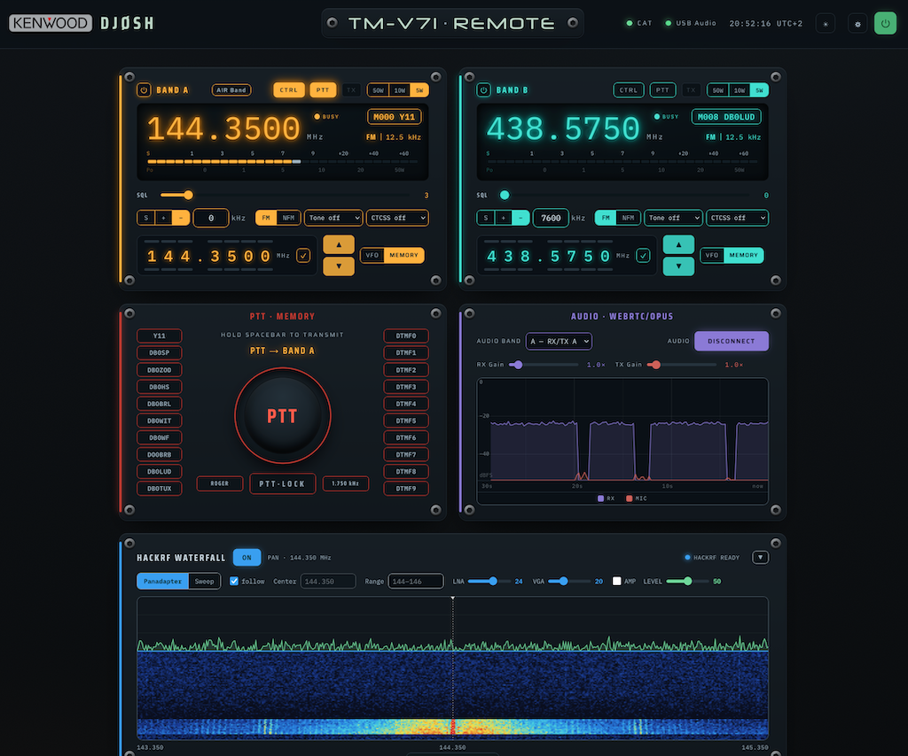

*A light and a dark theme are both included — switch between them any time with
the theme toggle in the header (light is the default).*

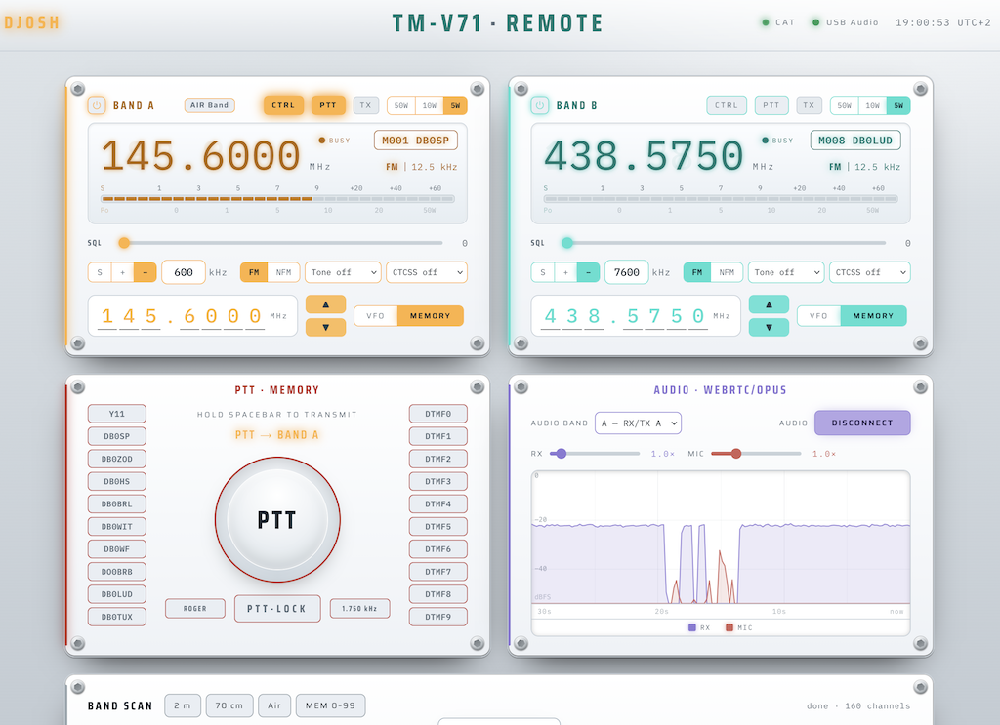

> Built for a Raspberry Pi with the radio on `/dev/ttyUSB0` (FTDI programming
> cable) at 57600 baud and a USB sound interface wired to the radio's data /
> mic / speaker connections.

---

📖 **Full manual (PDF):** [English](docs/Manual-EN.pdf) · [Deutsch](docs/Handbuch-DE.pdf)

## Features

- **Full live control** — both bands (A/B): frequency, VFO/memory mode, repeater
  shift & offset, CTCSS/DCS tone, step, control-band selection, and **PTT over
  CAT** (no separate PTT line).
- **Memory channels (CHIRP-level)** — read, write, delete and rename any of the
  1000 channels, plus CSV import/export.
- **Live status** — frequency, mode, tone, squelch/busy push to the browser over
  a WebSocket; transmit state lights the whole UI.
- **Two-way audio (direct WebRTC)** — the radio's RX/TX audio is bridged
  straight to the browser over **WebRTC/Opus** via `aiortc` — no extra app
  or proxy. Listen in the browser; the mic is fed to the radio only
  while PTT is engaged.
- **Digimodes & selcall** — a **Digi** panel encodes/decodes **CW** (MCW), **RTTY**
  (AFSK) and **POCSAG** paging (512/1200/2400 baud, numeric + alphanumeric, with
  BCH error correction) straight over the FM audio — e.g. monitor **DAPNET**
  (439.9875 MHz) with per-page RIC/FUNC/timestamp output and a "listen all"
  toggle. A separate **Selcall** panel does classic 5-tone selective calling
  (ZVEI/CCIR/EEA …), both decode and transmit.
- **SDR waterfall (optional, HackRF)** — if a HackRF One is connected, an extra
  panel shows a live spectrum + waterfall: a real-time **panadapter** centred on
  the tuned frequency (auto-following the radio) or a **wideband sweep** across a
  range. Receive-only and entirely optional — see [below](#sdr-waterfall-optional-hackrf).
- **Logbook (Wavelog + QRZ.com)** — a dedicated panel logs QSOs straight to a
  (typically self-hosted) [Wavelog](https://www.wavelog.org/) instance over its
  API. Enter just the callsign and name — frequency, band and mode are taken from
  the radio, and a [QRZ.com](https://www.qrz.com/) lookup auto-fills name, grid,
  QTH, e-mail and country. A "worked before" check and the latest contacts/totals
  are shown inline; recent entries are kept locally so they survive restarts.
- **No build step for the control UI** — the SPA is plain HTML/CSS/JS served
  directly by the backend. No Node toolchain required on the Pi.
- **Installable PWA / mobile-ready** — runs as an installable Progressive Web App
  (*Add to Home Screen* → full-screen, offline app shell). On phones the panels
  become a horizontal **swipe deck** with a bottom tab bar, forced to landscape.
  See [Mobile app (PWA)](#mobile-app-pwa).

## Why not hamlib?

hamlib's TM-V71 backends are unreliable in practice (model `2034` rejects the
reply termination, model `2035` hangs). The radio's documented PC command set,
however, works perfectly over a direct serial connection and exposes the radio's
*full* feature set — including per-channel memory programming, which hamlib does
not. So the backend owns the serial port directly (`backend/app/tmv71.py`).
Protocol reference: [LA3QMA/TM-V71_TM-D710-Kenwood](https://github.com/LA3QMA/TM-V71_TM-D710-Kenwood).

## Architecture

```
                          Raspberry Pi
 ┌───────────────────────────────────────────────────────────────┐
 │  /dev/ttyUSB0 (57600) ─ tmv71 driver ─┐                       │
 │                                       ▼                       │
 │   FastAPI backend ── REST + WebSocket (live status)           │
 │     • control (freq/mode/band/PTT)   • memory CRUD + CSV      │
 │     • PTT couples the audio bridge                            │
 │                                                               │
 │   USB sound ── aiortc WebRTC ◄──► browser (Opus, PTT-gated)   │
 │     (RX→browser track, browser mic→radio mic)                 │
 │                                                               │
 │   FastAPI serves the SPA at "/" and the WebRTC signalling at  │
 │   "/api/webrtc/offer" (SDP offer/answer, same origin/TLS)     │
 └───────────────────────────────────────────────────────────────┘
        ▲ LAN (HTTPS)
   Web browser  ·  installable PWA (control + audio, mobile-ready)
```

## Requirements

- Raspberry Pi (tested on Debian 13 / aarch64), Python 3.11+
- Kenwood TM-V71(A/E) on a serial port (FTDI programming cable)
- A USB sound interface wired to the radio (data port or mic/speaker), full-duplex
- System packages: `portaudio19-dev` (sounddevice), `swig` + `liblgpio-dev`
  (build `lgpio` for the optional GPIO power switch). WebRTC/Opus audio is
  in-process via `aiortc` (pip) — no audio server needed.
- Optional: a **HackRF One** plus the `hackrf` host tools for the SDR waterfall
  (see [SDR waterfall](#sdr-waterfall-optional-hackrf)).

### Python dependencies

Installed from [`backend/requirements.txt`](backend/requirements.txt):

| Package | Purpose |
| --- | --- |
| `fastapi`, `uvicorn[standard]` | REST + WebSocket server (HTTPS/TLS) |
| `pydantic`, `pydantic-settings` | request/response models, config |
| `pyserial` | serial CAT link to the radio |
| `python-multipart` | file uploads (logo, CSV import) |
| `aiortc` | **two-way browser audio over WebRTC/Opus** |
| `sounddevice` | USB sound-card I/O (PortAudio); `av`/`numpy` pulled in for frames |
| `numpy` | audio sample processing (levels, gain, tones) |
| `gpiozero`, `lgpio` | optional GPIO power switch (Raspberry Pi) |

## Radio setup

On the TM-V71(A/E), set the menu items:

- **519 (PC port baud rate) → 57600** — the CAT/serial rate this app uses
  (matches `TMV71_SERIAL_BAUD`).

The USB sound interface is wired to the radio's front **Mic/Speaker** jacks, not
the rear data connector. PTT is keyed over CAT (serial), and the TM-V71 only
routes audio to/from the rear data connector when it is keyed by a **hardware**
PTT — a serial PTT never switches that path. Using the front mic/speaker keeps
RX/TX audio on the normal, band-limited voice chain regardless of how PTT is keyed.

## Install

```bash
sudo apt-get install -y portaudio19-dev python3-venv swig liblgpio-dev

git clone https://github.com/CQ-DJ0SH/tmv71-remote.git
cd tmv71-remote/backend
python3 -m venv .venv
.venv/bin/pip install -r requirements.txt
```

Add the service user to the `dialout` (serial) and `audio` groups.

## Run

Browser microphone access (`getUserMedia`) requires a **secure context**, so the
server is run over **HTTPS**. Generate a self-signed certificate (use your Pi's
LAN IP in the SAN) and start uvicorn with TLS:

```bash
cd backend
mkdir -p certs
openssl req -x509 -newkey rsa:2048 -nodes -days 3650 \
  -keyout certs/key.pem -out certs/cert.pem -subj "/CN=tmv71-remote" \
  -addext "subjectAltName=IP:<pi-ip>,DNS:localhost,IP:127.0.0.1"

.venv/bin/uvicorn app.main:app --host 0.0.0.0 --port 8443 \
  --ssl-keyfile certs/key.pem --ssl-certfile certs/cert.pem
```

Open **`https://<pi-ip>:8443/`** and accept the self-signed certificate once.
This single process serves radio control, live status and the WebRTC audio
signalling — no extra services. For a reboot-proof setup see [`deploy/`](deploy/).

> Plain HTTP also works for control, but browser audio needs HTTPS (or a browser
> exception for the origin) because `getUserMedia` requires a secure context.
>
> A **self-signed** certificate is fine on the desktop (accept the warning once),
> but it is **not enough for the PWA on a phone**: installing to the home screen
> and the service worker both require a *trusted* secure context. Click-through
> exceptions don't count. To install the app on a phone, sign the certificate
> with your own root CA and trust that CA on the phone — see
> [Mobile app (PWA)](#mobile-app-pwa).

## Audio

Two-way audio is **direct WebRTC** between the browser and the backend (via
`aiortc`), using the **Opus** codec — no extra audio server or proxy. The backend bridges
the radio's USB sound device to a WebRTC peer: RX audio is sent to the browser,
and the browser microphone is fed to the radio's mic input **only while PTT is
engaged** (keyed from the web UI).

In the web UI, open the **AUDIO** panel, click **CONNECT** and allow the
microphone. Listen there; hold the large **PTT** button to transmit. Pick which
band's RX audio you hear with the **BAND** switch (RX‑A / RX‑B); TX always goes
via the radio's front mic input.

Optional processing (Settings → Audio; the decoders always get the raw signal):

- **RX de-emphasis** (adjustable time constant, on by default) — restores natural
  voice tone when the RX audio is taken from a flat **discriminator / 9600-baud
  data output** (which has no built-in de-emphasis). That output is ideal for the
  digimode decoders (POCSAG etc.) since it keeps the full low-frequency content.
- **RX squelch (software)** — the data output bypasses the hardware squelch, so
  this re-applies muting from the radio's own **BUSY** status (polled ~16×/s over
  CAT). It gates only what you hear (S-meter + level graph follow); the decoders
  still receive the un-squelched signal.
- **TX AGC** — automatic transmit-level control on the mic path (fast attack, slow
  release), overriding the manual TX Gain. A voice low-pass and per-device mic
  gain round out the audio options.

## Mobile app (PWA)

The UI is an installable **Progressive Web App**. Once installed it runs
full-screen (no browser chrome), and on phones the panels turn into a vertical
**swipe deck** — one panel per screen (VFO A · VFO B · PTT · Audio · HackRF ·
Selcall · Digi · Log · Info), swipe up/down or tap the side **tab rail** to
switch. The title bar becomes a slim vertical strip on the left, the tab rail
sits on the right. The app is forced to **landscape**; in portrait it shows a
"rotate" hint. The app shell is cached by a service worker, so it launches
instantly and the layout works offline (live control/audio still need the
backend reachable). The screen is kept awake (Wake Lock) while the app is open.

| | |
|---|---|
| **VFO A** | **VFO B** |
| 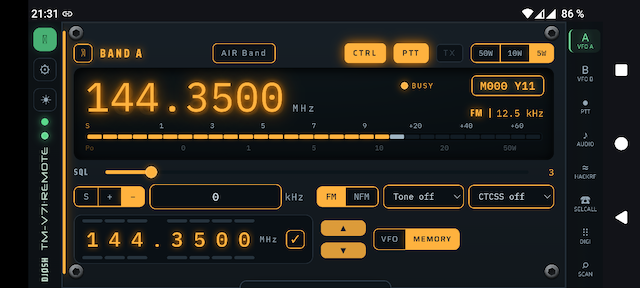 | 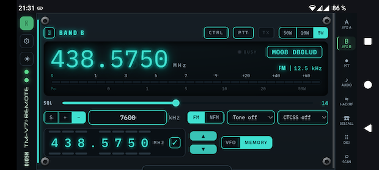 |
| **PTT** (transmitting — count-up timer + ring sweep) | **Audio** (WebRTC/Opus, RX/MIC levels) |
| 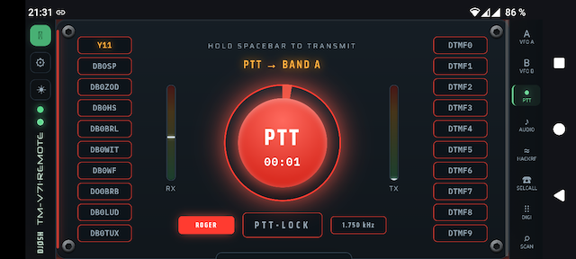 | 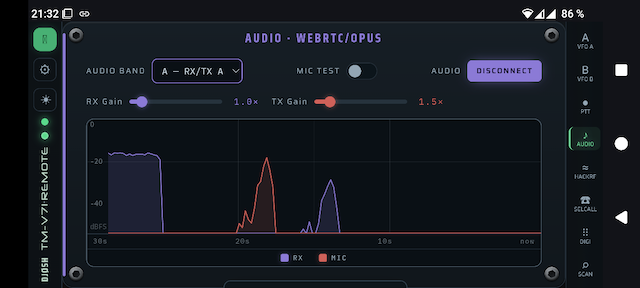 |
| **HackRF** waterfall (panadapter) | **Selcall** (5-tone) |
| 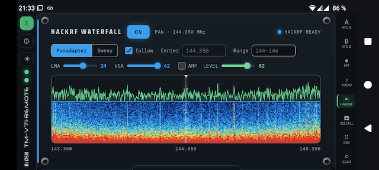 | 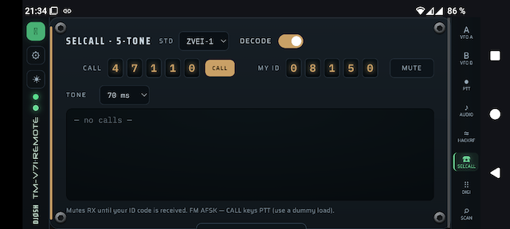 |
| **Digimodes — CW** | **Digimodes — RTTY / POCSAG** |
| 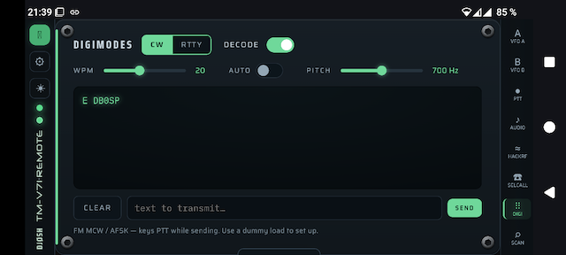 | 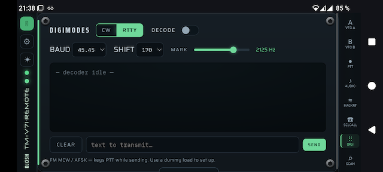 |
| **Band / memory scan** | **App & browser info** |
| 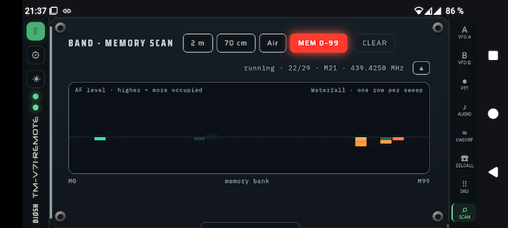 | 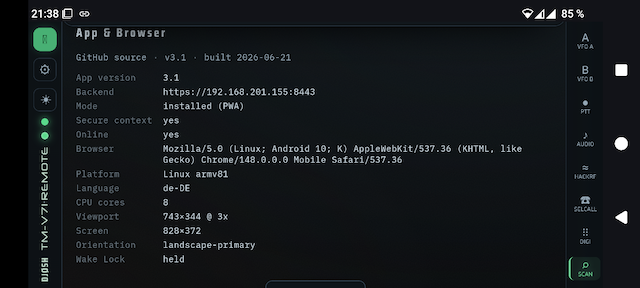 |

*The PTT panel has mini RX/TX VU bars (with 1 s peak-hold) flanking the key, and
shows a count-up timer with a clock-style ring sweep while transmitting.*

To install: open the site, then in the browser menu choose **Install** /
**Add to Home Screen** (Chrome offers an install icon in the address bar; on iOS
use **Safari → Share → Add to Home Screen**).

### Trusted certificate (required for install)

PWA install + service worker only work in a **trusted** secure context. A
self-signed certificate triggers a warning that you can click through on the
desktop, but mobile browsers then still **refuse to install the app or register
the service worker**. The fix is to run your own tiny **root CA**, sign the
server certificate with it, and trust that CA on the phone.

```bash
cd backend/certs

# 1) one-time: create a root CA (keep ca.key secret; valid 10 years)
mkdir -p ca
openssl genrsa -out ca/ca.key 4096
openssl req -x509 -new -key ca/ca.key -sha256 -days 3650 \
  -subj "/CN=TM-V71 Remote Root CA" \
  -addext "basicConstraints=critical,CA:TRUE,pathlen:0" \
  -addext "keyUsage=critical,keyCertSign,cRLSign" -out ca/ca.crt

# 2) server cert signed by the CA — list every name/IP you reach it by in the SAN
cat > leaf.ext <<'EXT'
basicConstraints = CA:FALSE
keyUsage = critical, digitalSignature, keyEncipherment
extendedKeyUsage = serverAuth
subjectAltName = @alt
[alt]
DNS.1 = tm-v71.example.lan
DNS.2 = localhost
IP.1  = 192.168.1.50
IP.2  = 127.0.0.1
EXT
openssl genrsa -out key.pem 2048
openssl req -new -key key.pem -subj "/CN=tm-v71.example.lan" -out server.csr
openssl x509 -req -in server.csr -CA ca/ca.crt -CAkey ca/ca.key -CAcreateserial \
  -days 825 -sha256 -extfile leaf.ext -out cert.pem
rm -f server.csr && chmod 600 ca/ca.key key.pem
sudo systemctl restart tmv71-remote.service   # pick up the new cert
```

The leaf cert is valid 825 days; re-run step 2 to renew (the CA is unchanged, so
phones that already trust it keep working). **Install the CA on the phone:**

1. Get `ca/ca.crt` onto the phone (download it in the browser, or copy it over).
2. Android: **Settings → Security → Encryption & credentials → Install a
   certificate → CA certificate**, then pick the file. iOS: open the `.crt`,
   install the profile, then enable it under **Settings → General → About →
   Certificate Trust Settings**.
3. Reload the site — no more warning, and **Install** becomes available.

> The certificate matches a hostname only if the phone resolves it to the Pi.
> For a private LAN name add a DNS record (router / Pi-hole) or just use the Pi's
> IP (it is in the SAN). The CA's private key (`ca/ca.key`) must stay on the Pi;
> the whole `backend/certs/` directory is git-ignored.

> ⚠️ Only transmit into a dummy load or with a valid amateur radio licence.

## SDR waterfall (optional, HackRF)

If a **HackRF One** is plugged into the Pi, the UI gains an extra collapsible
**HACKRF WATERFALL** panel (above the band scan) with a live spectrum and
waterfall. It is **receive-only** and **fully optional** — without a HackRF the
panel just reports "no HackRF detected" and nothing else is affected.

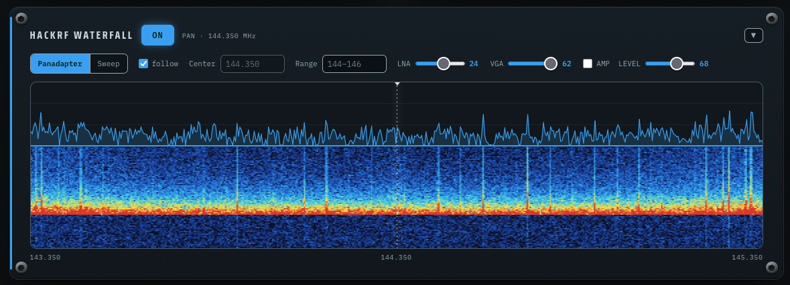

- **Panadapter** — live IQ via `hackrf_transfer`, FFT'd to a ~2 MHz span centred
  on the tuned frequency. With *follow* on it tracks the radio as you retune; a
  centre line marks the current frequency.
- **Sweep** — a wideband power sweep (`hackrf_sweep`) across a chosen range, for
  an overview of where the activity is.
- **LNA / VGA / AMP** set the HackRF's RF gain; the **LEVEL** slider sets the
  display contrast (peak height). **Hover** the graph to read frequency + dB;
  **double-click to tune the control VFO** to that point.

It needs the HackRF host tools (`hackrf_transfer`, `hackrf_sweep`):

```bash
sudo apt-get install -y hackrf
```

The HackRF is used exclusively while the panel is on; collapsing it or turning
it off releases the device.

## Configuration

All settings are overridable via `TMV71_*` environment variables (see
[`backend/.env.example`](backend/.env.example)). Common ones:

| Variable | Default | Meaning |
|---|---|---|
| `TMV71_SERIAL_PORT` | `/dev/ttyUSB0` | radio serial device |
| `TMV71_SERIAL_BAUD` | `57600` | serial baud rate |
| `TMV71_PORT` | `8443` | HTTPS port |
| `TMV71_AUDIO_DEVICE` | `NAD` | substring matched against the USB sound device |
| `TMV71_RX_GAIN` / `TMV71_TX_GAIN` | `1.0` | digital audio gain |
| `TMV71_AUDIO_ENABLED` | `true` | open the audio device / WebRTC bridge |
| `TMV71_GPIO_POWER_PIN` | _(unset)_ | BCM pin for the GPIO power relay |

**Logbook credentials** (Wavelog URL/API key/station id, QRZ.com
username/password/key) are entered in the web UI under *Settings → Logging* and
stored server-side in `runtime.json`, which is gitignored — secrets never enter
the repository.

## API

| Method | Path | Purpose |
|---|---|---|
| `GET` | `/api/status` | full radio status snapshot |
| `POST` | `/api/frequency` | `{band, freq_hz}` set VFO frequency |
| `POST` | `/api/band-mode` | `{band, mode}` 0=VFO 1=memory 2=call |
| `POST` | `/api/control-band` | `{control_band}` |
| `POST` | `/api/recall` | `{band, channel}` recall a memory channel |
| `POST` | `/api/ptt` | `{transmit}` key/unkey TX (gates mic→radio) |
| `POST` | `/api/power` | `{band, level}` TX power 0=50W/1=10W/2=5W |
| `POST` | `/api/squelch` | `{band, level}` squelch 0–31 |
| `POST` | `/api/band-display` | `{single, band}` dual/single band (DL) |
| `GET` | `/api/memories?start&end` | list populated channels |
| `GET`/`PUT`/`DELETE` | `/api/memories/{ch}` | read / write / delete a channel |
| `GET` | `/api/memories.csv` | CSV export |
| `POST` | `/api/memories/import` | CSV import (multipart) |
| `GET` | `/api/audio/status` | WebRTC audio bridge status + levels |
| `POST` | `/api/webrtc/offer` | WebRTC SDP offer → answer (browser audio) |
| `POST` | `/api/audio/gain` | `{rx_gain, tx_gain, tx_auto_gain}` RX/TX gain + TX AGC |
| `POST` | `/api/audio/tones` | roger beep / mic test / TX+RX low-pass / **de-emphasis** / **software squelch** |
| `POST` | `/api/data-band` | `{band}` which VFO's RX audio you hear |
| `GET`/`POST` | `/api/power-switch` | GPIO power on/off + auto-power-off status |
| `GET`/`POST` | `/api/digi` · `/api/digi/config` · `/api/digi/tx` | CW / RTTY / **POCSAG** decode + transmit |
| `POST` | `/api/selcall/config` | 5-tone selcall config + transmit |
| `GET` | `/api/hackrf` | SDR waterfall status (optional HackRF) |
| `POST` | `/api/hackrf/start` · `/stop` · `/config` | control the SDR waterfall |
| `GET`/`POST` | `/api/log/config` | get / set logbook (Wavelog + QRZ) settings |
| `POST` | `/api/log/test` · `/api/log/qrz/test` | test Wavelog / QRZ connection |
| `GET` | `/api/log/stations` | list Wavelog station profiles |
| `POST` | `/api/log/lookup` | callsign lookup (QRZ + worked-before) |
| `POST` | `/api/log/qso` | log a QSO to the configured providers |
| `GET` | `/api/log/recent` | recent local QSOs + Wavelog totals/online |
| `POST` | `/api/log/recent/delete` · `/recent/clear` | remove / clear local recents |
| `WS` | `/ws` | live status stream |
| `WS` | `/ws/hackrf` | live spectrum / waterfall frames (optional HackRF) |
| `WS` | `/ws/digi` · `/ws/selcall` | decoded digimode / selcall text stream |

## Security

LAN-only by design. There is no authentication. Do **not** expose port 8443
directly to the internet — use a VPN (e.g. WireGuard/Tailscale) or a reverse
proxy with TLS + auth.

## Status & roadmap

- ✅ Serial control, memory management, live status, web UI
- ✅ Direct two-way browser audio over WebRTC/Opus (`aiortc`)
- ✅ GPIO power switch, single-band (DL), TX power, squelch, in-display S-meter
- ✅ systemd packaging (see [`deploy/`](deploy/))
- ✅ Optional HackRF SDR waterfall (panadapter + wideband sweep)
- ✅ Installable PWA with a mobile swipe-deck layout (Add to Home Screen)
- ✅ Logbook panel — Wavelog QSO logging + QRZ.com lookup
- ✅ Digimodes — CW, RTTY and POCSAG (512/1200/2400, DAPNET) encode/decode
- ✅ 5-tone selcall (ZVEI/CCIR/EEA …) decode + transmit
- ✅ Audio processing — RX de-emphasis, BUSY-gated software squelch, TX AGC

## Credits

- Kenwood PC protocol docs — [LA3QMA/TM-V71_TM-D710-Kenwood](https://github.com/LA3QMA/TM-V71_TM-D710-Kenwood)
- [aiortc](https://github.com/aiortc/aiortc) (WebRTC/Opus), [sounddevice](https://python-sounddevice.readthedocs.io/)
- Fonts: Saira, IBM Plex Mono, DSEG (7-segment)

## License

GNU GPL v3 — see [LICENSE](LICENSE).
